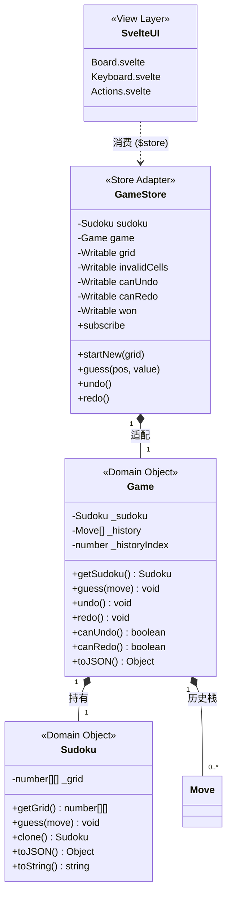

# DESIGN.md - HW1.1 领域对象接入 Svelte

## 0. 整体架构

### 架构总览

```
┌─────────────────────────────────────────────────────────┐
│                    Svelte UI 层                          │
│  Board / Keyboard / Actions 组件                         │
│  读取：$gameStore.grid  调用：gameStore.guess()          │
└──────────────┬──────────────────────────────┬────────────┘
               │ 订阅 ($store 语法)            │ 调用方法
               ▼                              ▼
┌─────────────────────────────────────────────────────────┐
│              Store Adapter (gameStore.js)                │
│  ┌───────────────────────────────────────────────────┐  │
│  │  writable: grid, initialGrid, invalidCells, ...   │  │
│  │  derived: subscribe (组合所有 writable)            │  │
│  ├───────────────────────────────────────────────────┤  │
│  │  startNew(grid)  guess(pos, value)                │  │
│  │  undo()          redo()                           │  │
│  └───────────────────────────────────────────────────┘  │
└──────────────┬──────────────────────────────┬────────────┘
               │ 调用                         │ 读取
               ▼                              ▼
┌─────────────────────────────────────────────────────────┐
│              领域对象 (Domain Layer)                     │
│  ┌───────────────────────────────────────────────────┐  │
│  │  Game (history, undo/redo)                        │  │
│  │    └→ Sudoku (grid, guess, clone, toJSON)         │  │
│  └───────────────────────────────────────────────────┘  │
│  位置: src/domain/                                      │
└─────────────────────────────────────────────────────────┘
```

### Mermaid 类图



---

## A. 领域对象如何被消费

### 1. View 层直接消费的是什么？

**View 层直接消费的是 `gameStore`（Store Adapter 单例）。**

- **不是**直接消费 `Game` 或 `Sudoku` 领域对象
- **而是**消费由 `createGameStore()` 创建的适配器对象

```javascript
// Board/index.svelte
import { gameStore } from '@sudoku/stores/gameStore';

// 模板中使用 $gameStore 自动订阅
{#each $gameStore.grid as row, y}
  ...
{/each}
```

**为什么选择 Store Adapter 而非直接消费领域对象？**

| 方案 | 优点 | 缺点 |
|------|------|------|
| 直接消费 Game/Sudoku | 简单直接 | 领域对象无响应式机制，UI 不会自动刷新 |
| Store Adapter（采用） | 兼容 Svelte 响应式系统 | 需要额外维护适配层 |
| 领域对象自身实现订阅 | 统一接口 | 污染领域对象纯度，违反单一职责 |

### 2. View 层拿到的数据是什么？

View 层通过 `$gameStore` 获取以下响应式数据：

| 字段 | 类型 | 用途 | 来源 |
|------|------|------|------|
| `grid` | `number[][]` | 当前用户填写的棋盘 | `sudoku.getGrid()` |
| `initialGrid` | `number[][]` | 初始谜题（区分预设/用户输入） | 保存的初始网格 |
| `invalidCells` | `string[]` | 冲突格子列表（"x,y" 格式） | `computeInvalidCells(grid)` |
| `canUndo` | `boolean` | 是否可撤销 | `game.canUndo()` |
| `canRedo` | `boolean` | 是否可重做 | `game.canRedo()` |
| `won` | `boolean` | 游戏是否完成 | `checkWon(grid)` |

### 3. 用户操作如何进入领域对象？

用户操作通过 `gameStore` 暴露的方法进入领域对象：

```
用户点击格子 → 输入数字
  → Keyboard.svelte 调用 gameStore.guess({x, y}, value)
    → gameStore 内部调用 game.guess({row: y, col: x, value})
      → Game 委托 sudoku.guess(move) 修改 grid
      → Game 记录 Move 到 _history
    → gameStore 调用 updateAllStores() 更新所有 writable
      → Svelte 检测到 store 变化
        → UI 自动刷新

用户点击 Undo 按钮
  → Actions.svelte 调用 gameStore.undo()
    → gameStore 内部调用 game.undo()
      → Game 从 _history 读取 previousValue
      → Game 委托 sudoku.guess() 恢复
    → gameStore 调用 updateAllStores()
      → UI 自动刷新
```

**关键代码路径：**

```javascript
// Controls/Keyboard.svelte
function handleKeyButton(num) {
    gameStore.guess($cursor, num);  // ← 用户输入进入领域对象
}

// Controls/ActionBar/Actions.svelte
<button on:click={gameStore.undo} disabled={!$gameStore.canUndo}>Undo</button>
<button on:click={gameStore.redo} disabled={!$gameStore.canRedo}>Redo</button>
```

### 4. 领域对象变化后，Svelte 为什么会更新？

**核心机制：`writable` store + 手动 `set()` 触发响应式更新。**

```javascript
// gameStore.js 内部
const grid = writable(sudoku.getGrid());  // 创建 writable store

function updateAllStores() {
    grid.set(sudoku.getGrid());           // ← 手动 set 触发更新
    invalidCells.set(computeInvalidCells(sudoku.getGrid()));
    canUndo.set(game.canUndo());
    canRedo.set(game.canRedo());
    won.set(checkWon(sudoku.getGrid()));
}

function guess(pos, value) {
    game.guess({ row: pos.y, col: pos.x, value });  // 领域对象变化
    updateAllStores();                               // ← 通知 Svelte
}
```

**Svelte 编译器将 `$gameStore.grid` 转换为：**

```javascript
// 编译器生成的伪代码
gameStore.subscribe(value => {
    updateGrid(value.grid);  // 每次 store 变化自动执行
});
```

---

## B. 响应式机制说明

### 1. 依赖的机制

本方案依赖以下 Svelte 机制：

| 机制 | 用途 | 位置 |
|------|------|------|
| `writable` store | 存储响应式状态，支持 `set()` 手动更新 | gameStore.js |
| `derived` store | 组合多个 writable 为单一订阅接口 | gameStore.js |
| `$store` 自动订阅 | Svelte 编译器自动处理订阅/取消订阅 | .svelte 组件 |

**不依赖的机制：**
- ❌ `$:` reactive statements（组件内未使用）
- ❌ reactive classes（Svelte 3 不支持）
- ❌ Svelte 5 runes（未升级）

### 2. 响应式暴露给 UI 的数据

```javascript
// gameStore.js 返回的 subscribe 由 derived 组合而成
subscribe: derived(
    [grid, initialGrid, invalidCells, canUndo, canRedo, won],
    ([$grid, $initialGrid, $invalidCells, $canUndo, $canRedo, $won]) => ({
        grid: $grid,
        initialGrid: $initialGrid,
        invalidCells: $invalidCells,
        canUndo: $canUndo,
        canRedo: $canRedo,
        won: $won
    })
).subscribe
```

**任何 writable 变化都会触发整个 derived 重新计算，进而通知所有订阅的组件。**

### 3. 留在领域对象内部的状态

以下状态**不暴露**给 UI，留在领域对象内部：

| 状态 | 位置 | 为什么隐藏 |
|------|------|------------|
| `_history` | `Game._history` | UI 不需要直接访问历史数组 |
| `_historyIndex` | `Game._historyIndex` | UI 只需知道 canUndo/canRedo |
| `_grid`（内部引用） | `Sudoku._grid` | UI 通过 getGrid() 获取深拷贝 |

### 4. 如果直接 mutate 内部对象会怎样？

**错误示例：**

```javascript
// ❌ 直接 mutate grid 元素
function guess(pos, value) {
    sudoku.getGrid()[pos.y][pos.x] = value;  // 修改了数组元素
    // 没有调用 grid.set() → Svelte 不知道变了 → UI 不刷新！
}
```

**为什么不会刷新？**

Svelte 的响应式检测基于**引用相等性**（reference equality）：

```javascript
const oldGrid = sudoku.getGrid();
sudoku.getGrid()[0][0] = 5;     // 元素变了，但数组引用没变
const newGrid = sudoku.getGrid();
oldGrid === newGrid;            // true → Svelte 认为没变化 → 不更新 UI
```

**正确做法：**

```javascript
// ✅ 通过 writable.set() 传入新引用
function guess(pos, value) {
    game.guess({ row: pos.y, col: pos.x, value });  // 领域对象内部已深拷贝
    grid.set(sudoku.getGrid());                     // 传入新引用 → Svelte 检测到变化 → 更新 UI
}
```

---

## C. 改进说明

### 1. 相比 HW1 的改进

| 改进项 | HW1 状态 | HW1.1 状态 |
|--------|----------|------------|
| 领域对象位置 | `code_yuri/`（独立目录） | `src/domain/`（正式源码目录） |
| UI 是否使用领域对象 | ❌ 否（只用于测试） | ✅ 是（Board/Keyboard/Actions 全部接入） |
| Undo/Redo 功能 | ❌ 未实现（空按钮） | ✅ 已实现（调用 game.undo/redo） |
| 响应式桥接 | ❌ 无 | ✅ Store Adapter（gameStore.js） |
| 测试入口 | ❌ `src/domain/index.js` 不存在 | ✅ 已创建，测试全部通过 |

### 2. 为什么 HW1 的做法不足以支撑真实接入？

HW1 中领域对象存在以下问题：

| 问题 | 说明 |
|------|------|
| **无响应式机制** | `createSudoku()` / `createGame()` 返回纯 JS 对象，没有 `subscribe` 方法，Svelte 无法订阅 |
| **UI 走旧逻辑** | Board 组件读取旧的 `$userGrid` store，Keyboard 调用 `userGrid.set()`，完全绕过了领域对象 |
| **Undo/Redo 未实现** | Actions 组件中 Undo/Redo 按钮没有绑定任何事件处理函数 |
| **测试与生产分离** | 领域对象只在 `tests/hw1/` 中使用，真实游戏界面仍然使用旧的函数式逻辑 |

### 3. 新设计的 trade-off

#### 优点

| 优点 | 说明 |
|------|------|
| **领域对象纯净** | `Game` / `Sudoku` 不依赖任何 UI 框架，可独立测试和复用 |
| **UI 与逻辑解耦** | Svelte 组件只负责渲染和事件转发，不包含游戏逻辑 |
| **响应式可控** | 通过 `updateAllStores()` 精确控制何时通知 UI 更新 |
| **向后兼容** | gameStore 同步更新旧 `userGrid`，hint/gameWon 等旧功能仍可工作 |

#### 缺点 / 权衡

| 权衡 | 说明 |
|------|------|
| **状态重复** | `gameStore` 同步更新旧 `userGrid` 造成状态冗余（为兼容 hint/gameWon） |
| **手动更新** | 每次操作后必须手动调用 `updateAllStores()`，遗漏会导致 UI 不刷新 |
| **坐标转换** | UI 使用 `{x, y}`，领域对象使用 `{row, col}`，Adapter 需要转换 |
| **initialGrid 维护** | 需要额外保存初始谜题以区分预设/用户输入 |

---

## D. 课堂讨论准备

### 1. View 层直接消费的是谁？

**答：** View 层直接消费的是 `gameStore`（Store Adapter），不是 `Game` 或 `Sudoku` 领域对象。

### 2. 为什么 UI 在领域对象变化后会刷新？

**答：** 因为 `gameStore` 内部使用 `writable` store，每次领域对象变化后调用 `grid.set(sudoku.getGrid())` 传入新引用，Svelte 检测到引用变化后自动更新订阅的组件。

### 3. 响应式边界在哪里？

**答：** 响应式边界在 `gameStore.js` 的 `derived` store。内部（领域对象）无响应式，外部（Svelte 组件）通过 `$gameStore` 自动订阅。

### 4. 哪些状态对 UI 可见，哪些不可见？

| 可见 | 不可见 |
|------|--------|
| `grid`, `initialGrid`, `invalidCells`, `canUndo`, `canRedo`, `won` | `_history`, `_historyIndex`, `Sudoku._grid`（内部引用） |

### 5. 如果迁移到 Svelte 5，哪一层最稳定？哪一层最可能改动？

| 层 | 稳定性 | 说明 |
|----|--------|------|
| **领域对象（domain/）** | ✅ 最稳定 | 纯 JS，不依赖任何框架，迁移无需改动 |
| **Store Adapter** | ⚠️ 可能改动 | Svelte 5 使用 `$state` / `$derived` runes，可能替代 `writable` / `derived` |
| **Svelte 组件** | ⚠️ 可能改动 | Svelte 5 使用 runes 语法（`$state`, `$derived`），组件写法会变化 |

---

## E. 文件结构

```
src/
├── domain/                          ← 领域对象（HW1.1 新增）
│   ├── index.js                     ← 统一导出
│   ├── sudoku.js                    ← Sudoku 领域对象
│   └── game.js                      ← Game 领域对象
│
├── stores/
│   └── gameStore.js                 ← Store Adapter（HW1.1 核心）
│
├── node_modules/@sudoku/
│   ├── game.js                      ← 修改：内部改用 gameStore.startNew()
│   └── stores/                      ← 保留：辅助 store（cursor, timer, hints...）
│
└── components/
    ├── Board/index.svelte           ← 修改：读取 $gameStore.grid
    ├── Controls/Keyboard.svelte     ← 修改：调用 gameStore.guess()
    └── Controls/ActionBar/Actions.svelte ← 修改：绑定 undo/redo
```
